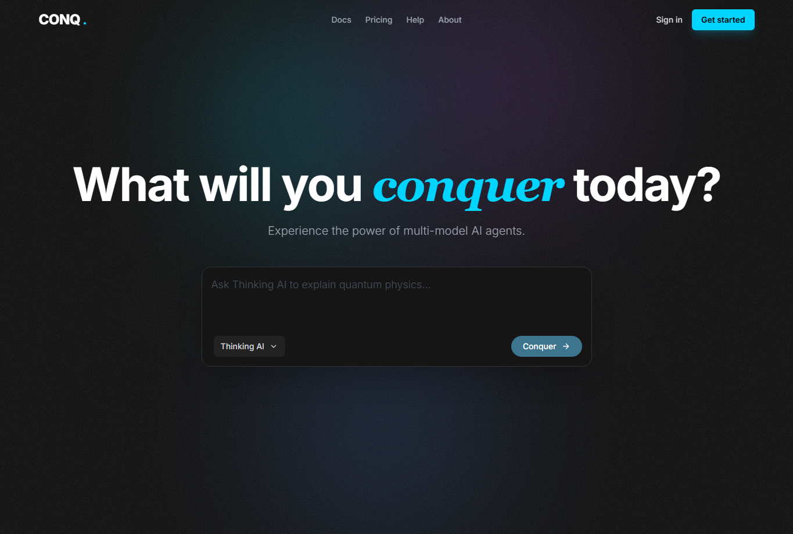
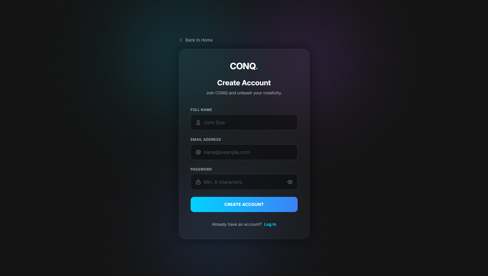
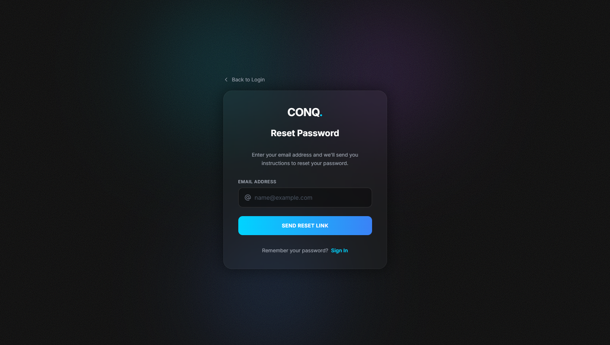
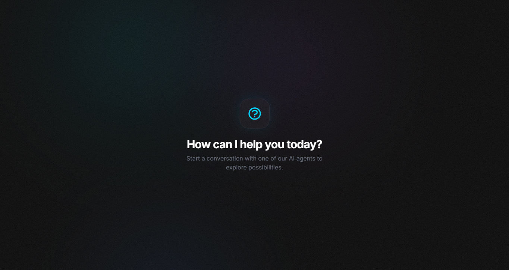
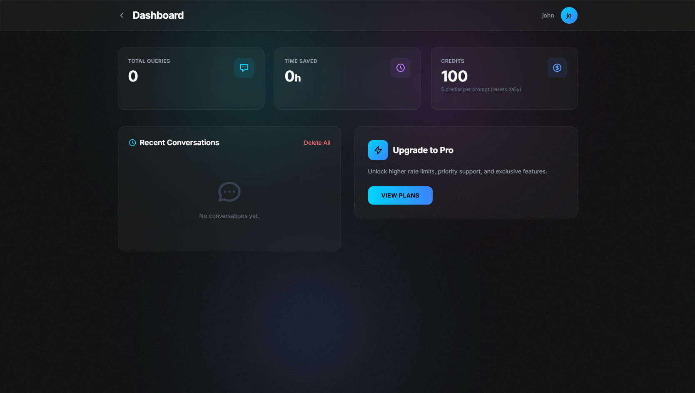
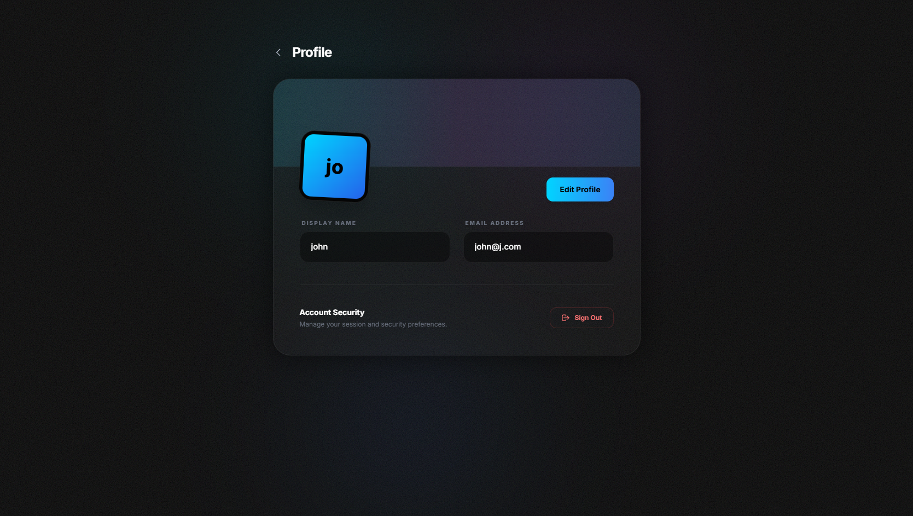
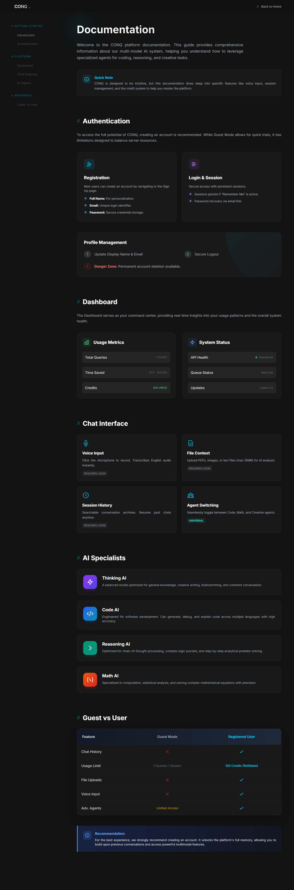
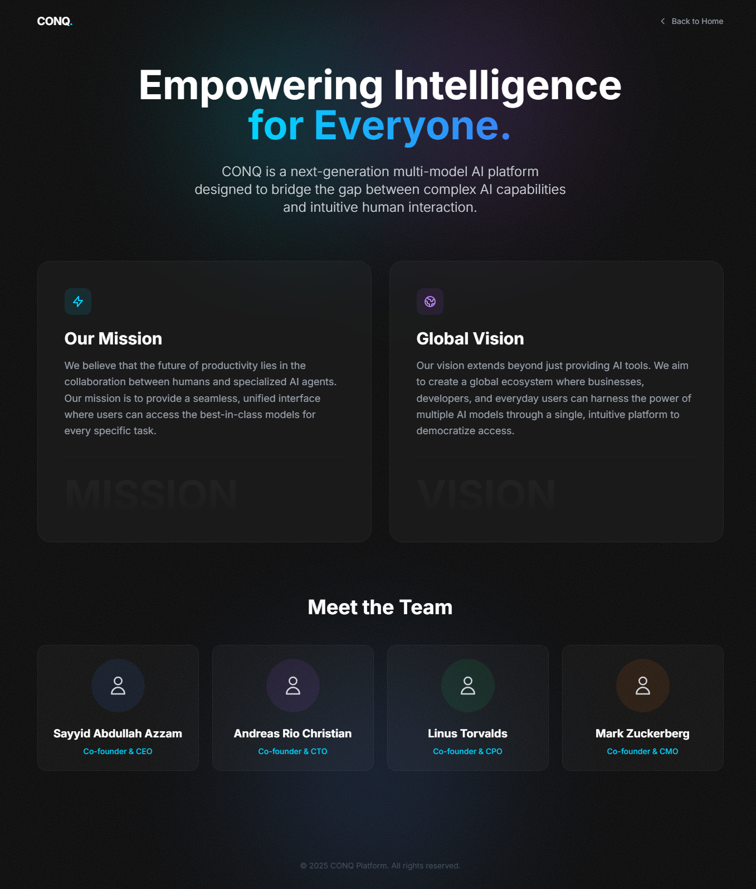

# Dokumentasi Proyek ConQ

## Daftar Isi
1. [Struktur Folder](#struktur-folder)
2. [Struktur Database](#struktur-database)
3. [Screenshot Aplikasi](#screenshot-aplikasi)

## Struktur Folder
```
conq/
├── app/
│   ├── Http/
│   │   └── Controllers/
│   ├── Models/
│   ├── Providers/
│   └── Services/
│       └── AI/
├── bootstrap/
├── config/
├── database/
│   ├── factories/
│   ├── migrations/
│   └── seeders/
├── public/
├── resources/
│   ├── css/
│   ├── js/
│   └── views/
│       ├── auth/
│       ├── chat/
│       └── components/
├── routes/
└── storage/
```

## Struktur Database

### Tabel: users
| Kolom | Tipe | Keterangan |
|-------|------|------------|
| id | bigint | Primary Key, Auto Increment |
| name | string | Nama pengguna |
| email | string | Email unik pengguna |
| email_verified_at | timestamp | Waktu verifikasi email |
| password | string | Password terenkripsi |
| plan | enum('Free', 'Pro', 'Enterprise') | Tipe langganan |
| credits | integer | Jumlah kredit pengguna |
| avatar | string (nullable) | URL avatar pengguna |
| remember_token | string | Token untuk remember me |
| created_at | timestamp | Waktu pembuatan |
| updated_at | timestamp | Waktu terakhir diupdate |

### Tabel: conversations
| Kolom | Tipe | Keterangan |
|-------|------|------------|
| id | uuid | Primary Key |
| user_id | bigint | Foreign Key ke users.id |
| title | string | Judul percakapan |
| agent_id | string | ID agen yang menangani |
| messages | json | Riwayat pesan dalam format JSON |
| created_at | timestamp | Waktu pembuatan |
| updated_at | timestamp | Waktu terakhir diupdate |

## Screenshot Aplikasi

### Tampilan Desktop

#### Halaman Home


#### Halaman Login


#### Halaman Register


#### Halaman Lupa Password


#### Halaman Prompt


#### Halaman Dashboard


#### Halaman Profile


#### Halaman Dokumentasi


#### Halaman Harga


#### Halaman Bantuan


#### Halaman Tentang


### Tampilan Mobile

*Coming soon - Screenshot mobile akan ditambahkan di sini*

